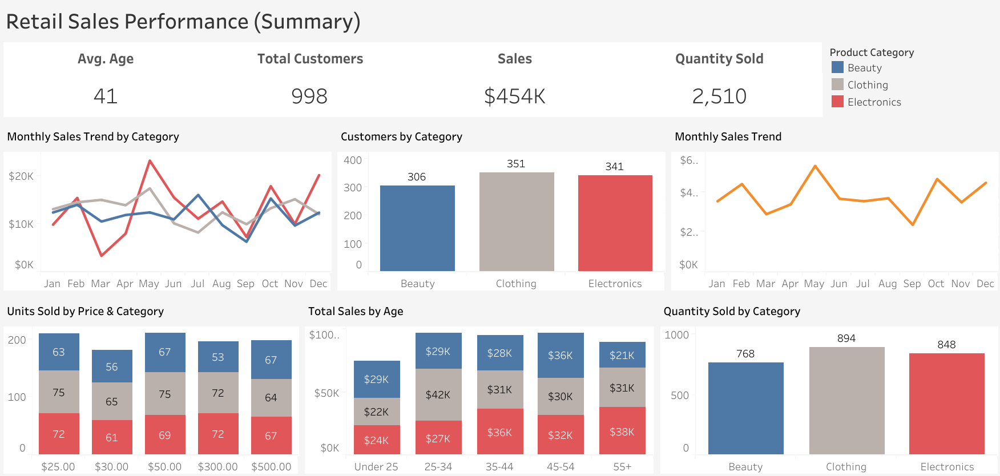

# Analyzing Retail Sales Performance and Customer Demographics (2023) 

## Table of Contents 

1. [Project Background](#project-background)
2. [Data Structure](#data-structure)
3. [Executive Summary](#executive-summary)
4. [Insights Deep Dive](#insights-deep-dive)
5. [Recommendations](#recommendations)
6. [Assumptions & Limitations](#assumptions--limitations)
7. [Next Steps](#next-steps)

### Project Background
Retail businesses often struggle to understand how different customer attributes and product categories contribute to overall sales performance. Without a clear understanding of which categories drive sales, how customer demographics influence purchasing behavior, and how product pricing affects demand, it is difficult to optimize inventory, marketing, or pricing strategies. 

This project analyzes retail sales data to identify patterns across product categories, gender, age groups, and price points. The goal is to uncover which categories perform best, how customer demographics shape spending, and where opportunities exist to improve sales, enhance target marketing efforts, and refine product inventory. 

Data cleaning & preparation was done in Excel. The raw dataset, cleaned dataset, pivot tables, and a data cleaning log to document transformations can be downloaded here: [(Data)](retail_sales_dataset.xlsx).

An interactive Tableau dashboard used to report and explore sales trends can be found here: [(Dashboard)](https://public.tableau.com/views/RetailSales_17846031200520/Summary?:language=en-US&:sid=&:redirect=auth&:display_count=n&:origin=viz_share_link).

Insights and recommendations are provided on the following key areas:
- **Category Performance**: Comparative analysis of product categories and their impact on sales. Categories include Beauty, Clothing, and Electronics.
- **Gender Insights**: An analysis of buying behavior of males and females across categories.
- **Age Group Insight**s: An analysis of customer age and their buying behavior. Ages range from 18-64 and were broken down into five groups; Under 25, 25-34, 35-44, 44-54, and 55+. 
- **Price Point Insights**: An evaluation of sales and demographics by price. Prices were $25, $30, $50, $300, and $500. 

### Data Structure:
- Data Source: Kaggle, includes 998 rows and 9 columns.
- Key Variables: Transaction ID, Date. Customer ID, Age, Gender. Product Category, Quantity, Price per Unit, and Total Amount.
- Data Limitations: 1 year of data (2023)

### Executive Summary
Overall, the analysis reveals a balanced distribution of sales across categories, minimal demographic differences, and clear patterns in price‑driven purchasing behavior. Electronics leads in total sales, Clothing leads in customer volume, and Beauty shows concentrated demand for high-priced items. The following sections will further explain these findings and highlight opportunities for improvement.

Below is the summary page for the Tableau dashboard. 

  
### Insights Deep Dive
#### Category Performance: 
- Electronics leads in total sales. However, its sales are nearly tied with Clothing showing a $2K difference. Beauty had the lowest total sales. Electronics compared to Beauty shows a $15K difference in total sales. Clothing compared to Beauty shows a $13K difference.
- When comparing each category’s sales to total sales, no category dominates: Electronics = 34.6%, Clothing = 34.1%, and Beauty = 31.3%. The mix is balanced.
- Though Electronics leads in total sales, Clothing had the greatest number of customers and quantity sold. Beauty had the lowest number of customers and quantity sold. 

#### Gender Insights: 
- Total sales amount was $454K, and females contributed a larger portion to total sales than males, leading by 2% (males = 49%, females = 51%). Overall, this shows there wasn't a significant difference in total sales between males and females. Similarly, there were only 22 more females than males.
- Females dominated sales for Clothing and Beauty. They led by $8K and $7K, respectively. Most electronic sales were from males. Males led electronic sales by $3K.  
- Most customers were from females ages 45-54. However, males dominated total sales for this age group.

#### Age Group Insights:
- Across all categories, 25-34 and 45-54 contributed the most amount in sales, tied at 97k. Males dominated sales in the 45-54 age group with most sales going towards Beauty. Females dominated sales in the 25-34 age group with most sales going towards Clothing.
- The fewest number of customers and lowest total sales was for Beauty, which consisted of mostly females ages 45-54. However, men in this age group generated the most in total sales leading by $3k. Clothing was dominated by females ages 35+, but the age group 25-34 generated the most in sales with males leading by $2K. Electronics was dominated by men ages 45+ with the most amount in sales coming from men ages 55+.

#### Price Point Analysis: 
- The highest priced items ($500) were sold in the Beauty and Electronics category. 
- More $25 and $50 items were sold than any other unit price and items were in the Clothing category.  Overall popular categories for low-priced items were Clothing and Electronics.

### Recommendations
- Clothing has the largest customer base and highest volume of items sold. Developing bundled offers and seasonal promotions could greatly influence sales. Furthermore, considering most Clothing sales in the $300-$500 range were from individuals ages 25-34, it appears younger people would be the target market for higher priced items.
- Beauty has the fewest number of customers, which are majority female, and most sales are high-priced items. Developing premium product marketing, female-focused campaigns, and personalized promotions for ages 45-54 could improve sales.
- Total spending is balanced, but more males purchased Electronics. Directing promotional efforts toward males could increase sales or at least help to maintain them. 
- Beauty and Electronics have a large gap in price points that had the most units sold. For Clothing, $25 and $50 were the popular price points. Expanding inventory to include mid-priced, budget-friendly options for Beauty and Electronics might appeal to more consumers. For Clothing, expanding inventory to include a greater variety of low-priced items could increase sales.

### Assumptions & Limitations:
- Only shows 1 year of data, not enough data to know seasonal trends or outside factors that could have impacted sales overtime.
- Assumes all customers only purchased from one category. 
- There were 2 erroneous data points for Jan 1 2024. As all other data is from 2023, this data was excluded from analysis.
- No customer ids were the same, so data assumes no returning customers. 

### Next Steps:
- Gather more data to compare sales by seasons and year to note any significant differences.
- Find which products are driving sales for each category.
- Gather more data to analyze repeat customer buying behavior to potentially develop loyalty programs to maximize profits.
